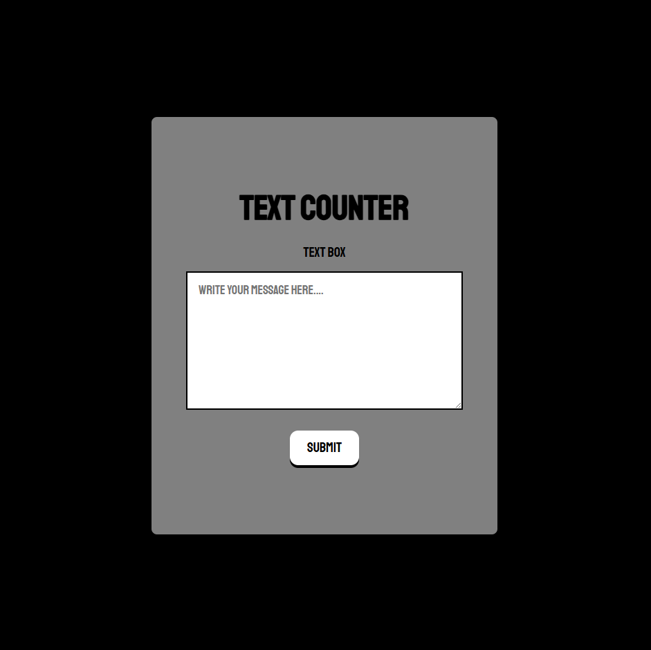
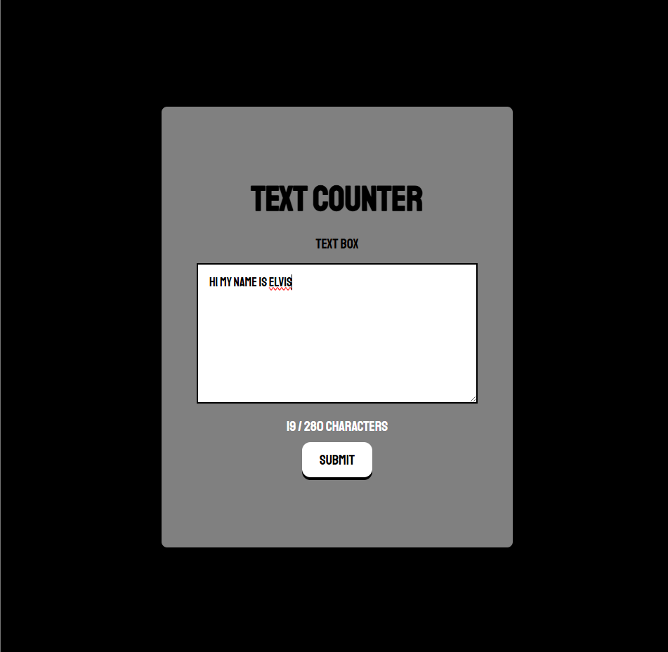
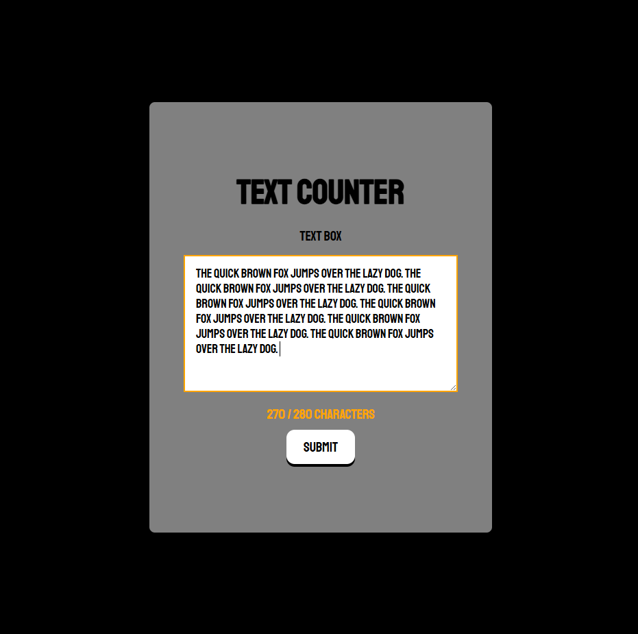
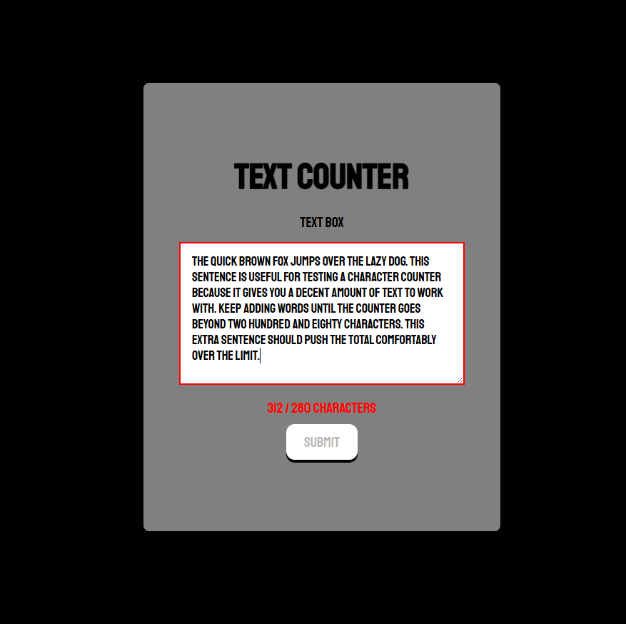

# week-2-day-3-assignment
this is are exercises targeting DOM Manipulation

## Task 1: Character Counter

A dynamic character counter built using HTML, CSS, and JavaScript DOM manipulation.

## Features

- Displays the number of characters typed out of a maximum of 280.
- Updates the character count in real time using the `input` event.
- Changes the counter and textarea border to **orange** when the count is between 261 and 280 characters.
- Changes the counter and textarea border to **red** when the count exceeds 280 characters.
- Disables the submit button when more than 280 characters are entered.
- Prevents form submission if the character count is greater than 280.
- Uses JavaScript to dynamically create the character counter `<span>` element.
- Uses CSS pseudo-classes to control the submit button's `hover`, `active`, and `disabled` states.

## Technologies Used

- HTML5
- CSS3
- JavaScript
- DOM Manipulation
- Event Listeners

---

## Implementation

### HTML

The HTML provides the basic structure of the application, including:
- A form
- A textarea for user input
- A paragraph that acts as the container for the dynamically created character counter
- A submit button

### CSS

CSS is used to style the application and visually represent the different character-count states.

| Character Count | Counter | Textarea Border | Submit Button |
| :--- | :--- | :--- | :--- |
| 0–260 | White | Black | Enabled |
| 261–280 | Orange | Orange | Enabled |
| 281+ | Red | Red | Disabled |

The submit button also uses the following pseudo-classes so the hover and click animations only apply while the button is enabled:
- `.submit-btn:not(:disabled):hover`
- `.submit-btn:not(:disabled):active`

The `:disabled` pseudo-class is used to control the button's disabled state.

### JavaScript

JavaScript selects the required DOM elements and listens for user input:

```js
textbox.addEventListener("input", function() {
    // character-count logic
});
```

The current character count is obtained using:

```js
textbox.value.length
```

The character counter is created dynamically with:

```js
document.createElement("span")
```

and added to the page using:

```js
characters.appendChild(countNumber)
```

A separate submit event listener checks the current character count and prevents submission when the count exceeds 280:

```js
form.addEventListener("submit", function(event) {
    if (textbox.value.length > 280) {
        event.preventDefault();
    }
});
```

---

## Screenshots

### Initial State
The application before any text is entered.


### While Typing
The character counter updates as text is entered.


### 261–280 Characters
The counter and textarea border change to orange when the character count reaches the warning range.


### Over 280 Characters
The counter and textarea border change to red, and the submit button becomes disabled.



---

## What I Practiced

This task helped me practice:

- Selecting elements with `querySelector()`
- Creating elements with `createElement()`
- Adding elements with `appendChild()`
- Changing text with `textContent`
- Reading form values with `.value`
- Using `.length` to count characters
- Adding event listeners with `addEventListener()`
- Handling `input` and `submit` events
- Using `event.preventDefault()`
- Adding and removing CSS classes with `classList`
- Using CSS pseudo-classes such as `:hover`, `:active`, `:disabled`, and `:not()`
- Managing different UI states based on user input
